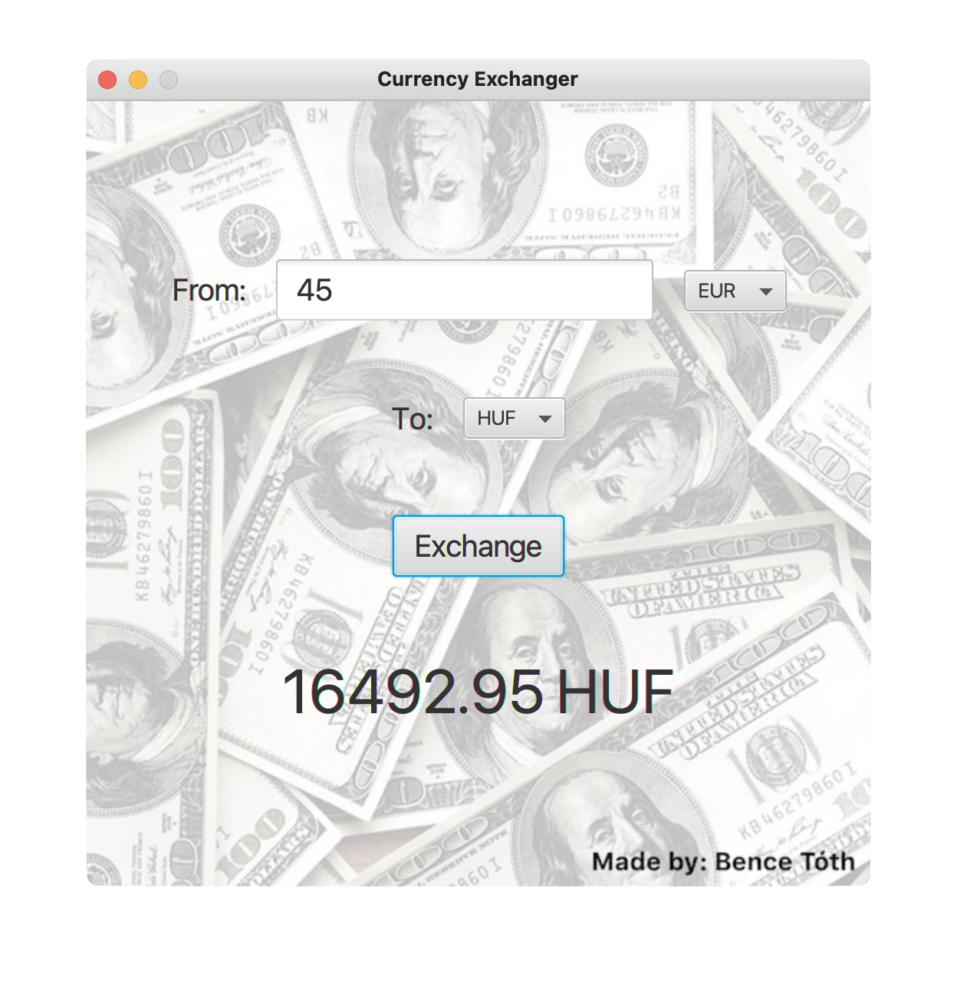

# Currency Exchanger
### Kotlin-based software development homework

This is a desktop currency exchanger application supporting multiple currencies.
It uses the [Foreign exchange rates API](http://exchangeratesapi.io) published by the European Central Bank.
The application is written in Kotlin, using Retrofit for the requests and responses,
and JavaFX for the GUI.

